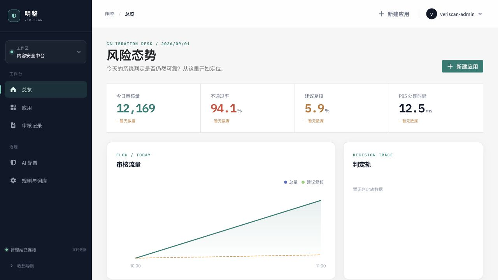
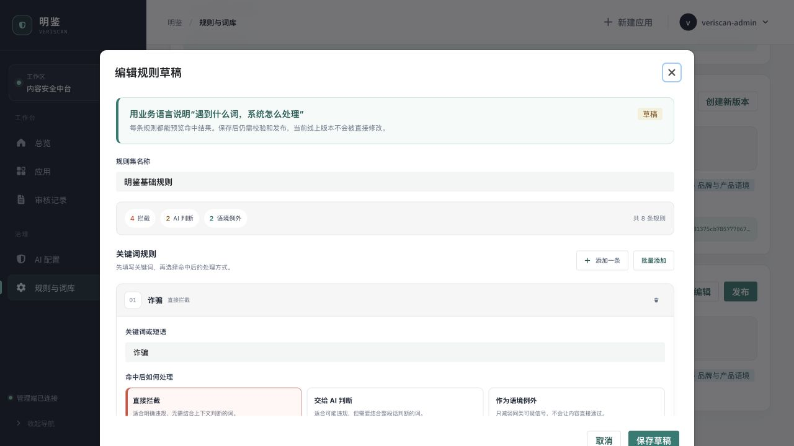
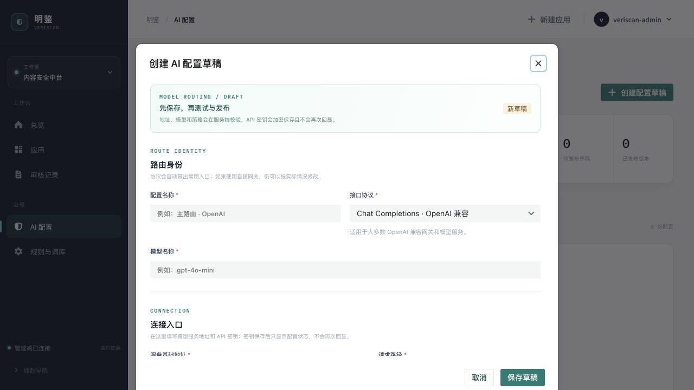

# VeriScan

[中文](README.md) | [English](README.en.md)

VeriScan is a content-safety moderation service for business applications. It uses versioned keyword rules for low-cost screening, routes unresolved content to a configurable external AI provider, and exposes a batch API secured by application-specific API keys. The system records and returns `pass`, `reject`, or `review`; a `review` decision is handed back to the caller, and VeriScan does not operate a second human-review workflow.

> This repository is still in local development and validation. The benchmark below is a short single-machine run, not a production SLA. An API process crash was reproduced at concurrency 128; see [Load test results](#load-test-results-2026-09-01).

## Screenshots

### Risk overview



### Operations-friendly rule editor



Rules are expressed as a keyword, a risk category, and the action to take on a match. Operators can add one rule at a time or paste one keyword per line, without learning internal `black`, `suspicious`, `white`, category-code, or decimal-weight formats.

### External AI configuration



The admin console configures the model, request URL, protocol, timeout, concurrency, and provider API key. The current adapters support Chat Completions, the Responses API, and Anthropic Messages request formats. A saved secret is never returned in plaintext.

## Highlights

- **Two-stage moderation:** compiled keyword rules run first; trusted hard rejects return immediately, while unresolved content is sent to external AI.
- **Governed policies:** validate drafts, publish immutable revisions, copy a published revision, bind an application explicitly, and preserve the effective policy revision on every request.
- **External AI routing:** manage model endpoints in the console, test connectivity, publish, and activate a configuration. Missing or failed AI calls conservatively return `review` according to policy instead of pretending an AI decision exists.
- **Per-application authentication:** each application owns independent API keys with scopes, expiry, rotation, and revocation. Usage and decision statistics are attributed to that application.
- **Audit records, not a review queue:** requests, items, effective policies, routes, risk scores, and final states are recorded. Human review remains the caller's responsibility.
- **Small operational footprint:** ASP.NET Core 10, PostgreSQL 16, Redis, and a React 19 + Vite admin console managed with pnpm.

## Repository layout

```text
apps/
  api/                  ASP.NET Core 10 API
  admin/                React 19 + Semi Design admin console
packages/
  contracts/            Planned OpenAPI-derived client and shared contracts
tests/
  backend/              Backend unit and integration tests
  performance/          Rule-engine baseline and HTTP load harness
infra/                  Local PostgreSQL, Redis, and Keycloak dependencies
docs/                   Implementation, acceptance, and UI documentation
```

## Local setup

Prerequisites: .NET SDK 10.0.400, Node.js 24+, pnpm 11+, and Docker.

### 1. Install packages and start infrastructure

```bash
pnpm install
cp infra/.env.example infra/.env
# Local development only: starts PostgreSQL, Redis, and Keycloak
docker compose --env-file infra/.env -f infra/compose.yaml up -d --wait
```

Replace the example passwords in `infra/.env`. This Compose file starts infrastructure only; run the API and frontend as described below.

### 2. Start the API

Generate and securely store one stable master key for encrypting managed AI credentials:

```bash
openssl rand -base64 32
export VERISCAN_AI_MASTER_KEY='<paste and persist the generated value>'
```

Then start the API. These sample values are for local development only. Reuse the same `Security__AiCredentials__MasterKey` after every restart:

```bash
ConnectionStrings__VeriScan='Host=127.0.0.1;Port=5432;Database=veriscan;Username=veriscan;Password=veriscan-local-postgres-change-me' \
ConnectionStrings__Redis='127.0.0.1:6379,password=veriscan-local-redis-change-me' \
Database__AutoMigrate=true \
Security__ApiKey__Pepper='replace-with-at-least-32-bytes-local-only' \
Security__AiCredentials__MasterKey="$VERISCAN_AI_MASTER_KEY" \
ExternalAi__AllowedHosts__0='api.openai.com' \
ExternalAi__AllowedPorts__0=443 \
ASPNETCORE_URLS='http://127.0.0.1:5000' \
dotnet run --project apps/api/Api
```

External AI has no outbound-host permission by default. Add self-hosted or third-party targets to `ExternalAi__AllowedHosts` / `ExternalAi__AllowedPorts`, and enforce the same boundary with deployment-level egress controls.

### 3. Start the admin console

```bash
cp apps/admin/.env.example apps/admin/.env.local
pnpm --dir apps/admin dev
```

Open `http://127.0.0.1:5173`. Create a local Keycloak user with the `veriscan-admin` role before signing in. Mock data is enabled only when `VITE_API_MODE=mock` is set explicitly; a real-mode or OIDC configuration failure never silently falls back to mock mode.

## Configuration flow

1. Create a draft under **Rules & Library**, express rules in business language, validate them, and publish the revision.
2. Under **AI Configuration**, choose the protocol, enter the model, service URL, and API key, then test, publish, and activate the configuration.
3. Create a caller under **Applications**, bind a published rule revision, and issue an API key with `moderation:submit` / `moderation:read` scopes.
4. Copy the plaintext API key only when it is created or rotated. The server stores only its digest and cannot recover it later.

Provider secrets are submitted from the admin console and encrypted with AES-GCM under a separate master key. Read APIs return only a configured/not-configured state. Leaving the key blank while editing preserves it; entering a new key rotates it. Never put provider secrets, application API keys, the API-key pepper, or the encryption master key in logs, `appsettings*.json`, or Git. Production deployments should keep the master key in a Secret Manager, Vault, or KMS and back it up separately from the database.

## Moderation API

### Submit a batch

```bash
curl --request POST 'http://127.0.0.1:5000/api/v1/moderation/batches' \
  --header 'Content-Type: application/json' \
  --header 'X-API-Key: <application-api-key>' \
  --header 'Idempotency-Key: order-comment-20260901-001' \
  --data '{
    "mode": "sync",
    "items": [
      {
        "id": "comment-001",
        "content": "Text to moderate",
        "contentType": "plain_text",
        "language": "en"
      }
    ]
  }'
```

Limits: 1–100 items per batch, at most 65,536 characters per item, and `plain_text` only for now. A synchronous request returns HTTP 200; `results[].decision` is `pass`, `reject`, or `review`. Use a unique `Idempotency-Key` for safely replayable submissions.

### Read a recorded batch

```bash
curl 'http://127.0.0.1:5000/api/v1/moderation/batches/<request-id>' \
  --header 'X-API-Key: <application-api-key>'
```

An API key can read records only for its own application. `/healthz` is the liveness endpoint; `/readyz` verifies PostgreSQL connectivity and pending migrations.

## Load test results (2026-09-01)

### Environment and scope

- Apple M1 Max, 10 logical processors, 64 GB RAM, Docker Desktop.
- .NET 10.0.11, PostgreSQL 16.10, Redis 7.4.5.
- The API ran with Development / Information logging; application and EF SQL logs reduce throughput.
- HTTP figures are client-observed end-to-end results including API-key validation, JSON, rule evaluation, Redis / PostgreSQL, and moderation-record persistence.
- No external AI provider was active, so these results do not measure provider latency, provider rate limits, or real model throughput.

### In-process rule-engine baseline

10,000 rules and 100,000 measured iterations, run three times. The table reports the run with median throughput:

| Metric             |        Result |
| ------------------ | ------------: |
| Policy compilation |     27.847 ms |
| Mean latency       |      3.765 µs |
| P95                |      4.375 µs |
| P99                |      4.875 µs |
| Throughput         | 265,583 ops/s |
| Allocation         |    1,432 B/op |

This baseline measures only in-process rule evaluation. It excludes HTTP, databases, authentication, AI, and network latency.

### Stable HTTP profiles

Each profile ran three times. The table reports the run with median throughput:

| Profile                           | Requests × items | Concurrency |                      Throughput | Client P95 |      P99 | Errors |
| --------------------------------- | ---------------: | ----------: | ------------------------------: | ---------: | -------: | -----: |
| Trusted hard reject               |        2,000 × 1 |          32 |                 1,733 batches/s |   28.95 ms | 34.16 ms |      0 |
| Mixed batch (9 reject + 1 review) |         500 × 10 |          16 | 776.8 batches/s / 7,768 items/s |   29.09 ms | 33.04 ms |      0 |

The mixed-batch semantic sample produced 9 `reject` and 1 `review`, all through `local_rules`. With no active AI configuration, `review` is the conservative policy outcome, not external-model inference. The screenshot's P95 is a server-side dashboard aggregate, while the table uses client-observed end-to-end P95; the two values are not interchangeable.

### Concurrency sweep and known failure boundary

| Concurrency | Requests |                 Throughput |      P95 | Outcome                                                                         |
| ----------: | -------: | -------------------------: | -------: | ------------------------------------------------------------------------------- |
|           1 |      500 |                153.8 req/s |  9.12 ms | 0 errors                                                                        |
|           8 |    1,000 |                971.4 req/s | 11.10 ms | 0 errors                                                                        |
|          64 |    3,000 |              1,751.9 req/s | 56.13 ms | 0 errors                                                                        |
|         128 |    3,000 | No valid throughput result |  Invalid | **API exited with code 139; only 8 HTTP 200 responses and 2,992 client errors** |

The concurrency-128 run is a failure, not a performance score. Docker restarted the API container, but the local Keycloak loopback compatibility sidecar remained attached to the old network namespace and had to be recreated before admin authentication recovered. Before production trials, the project needs a native-crash diagnosis, explicit concurrency limits and backpressure/rate limiting, sidecar lifecycle correction, and 60+ minute soak tests against real AI providers. Only short local runs at concurrency 64 or lower are currently useful as a development baseline.

### Reproduce

Rule engine:

```bash
dotnet run --project tests/performance/RuleEngine.Baseline/RuleEngine.Baseline.csproj \
  --configuration Release -- 10000 100000
```

The HTTP harness persists real moderation records. Create a temporary application API key and revoke it immediately afterward. The script never prints the key:

```bash
VERISCAN_API_KEY='<temporary-key>' \
node tests/performance/http-load.mjs hard 2000 32

VERISCAN_API_KEY='<temporary-key>' \
node tests/performance/http-load.mjs mixed 500 16
```

Set `VERISCAN_BASE_URL` to override the default `http://127.0.0.1:5000`. Do not run this against production data.

## Build, test, and container images

```bash
dotnet test VeriScan.slnx
dotnet build VeriScan.slnx -c Release
dotnet format VeriScan.slnx --verify-no-changes
pnpm --dir apps/admin test
pnpm --dir apps/admin lint
pnpm --dir apps/admin typecheck
pnpm --dir apps/admin build
pnpm --dir apps/admin format:check
```

```bash
docker build -f apps/api/Dockerfile -t veriscan-api:local .
docker build -f apps/admin/Dockerfile -t veriscan-admin:local \
  --build-arg VITE_OIDC_AUTHORITY=https://identity.example/realms/veriscan \
  --build-arg VITE_OIDC_REDIRECT_URI=https://admin.example/auth/callback .
```

The API image starts the service by default and can also run a one-shot migration job with `dotnet VeriScan.Api.dll --migrate`. Production deployments must inject database, Redis, API-key pepper, and AI credential-encryption secrets from a secret-management system; never bake them into an image or commit them to the repository.

## Project documentation

- [Implementation plan](docs/IMPLEMENTATION_PLAN.md)
- [Acceptance report](docs/ACCEPTANCE_REPORT.md)
- [Technical proposal (Chinese)](VeriScan-CMS-%E6%8A%80%E6%9C%AF%E6%96%B9%E6%A1%88-v2.md)
