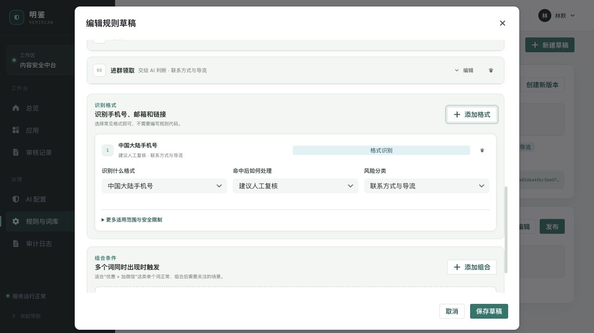

# VeriScan（明鉴）

[中文](README.md) | [English](README.en.md)

VeriScan 是面向业务系统的内容安全审核服务。它用版本化关键词规则完成低成本快筛，将未决内容路由到可配置的外部 AI，并通过应用级 API Key 暴露批量审核接口。系统只记录和返回 `pass`、`reject`、`review` 结果；`review` 由调用方自行接入人工流程，VeriScan 不内置二次人工复审。

> 当前仓库仍处于本地开发与验证阶段。下方压测是单机短时结果，不是生产 SLA。高并发异常已通过认证前入口并发闸门改为受控 `429`，但真实供应商、长稳压测和生产容量仍需在目标环境验证。

## 界面预览

### 风险总览


### 面向运营人员的规则编辑器



规则以业务语言呈现，支持关键词、手机号/邮箱/链接等常见格式，以及“多个词同时出现”的组合条件。运营人员无需理解 `black`、`suspicious`、`white`、正则语法、内部分类代码或小数权重；技术安全限制只在高级区域按需展开。

### 外部 AI 配置


管理后台可配置模型、请求地址、协议、超时、并发和供应商 API 密钥。当前适配 Chat Completions、Responses API 和 Anthropic Messages 三类请求格式；密钥写入后不会再次明文回显。

## 核心能力

- **两级审核**：编译后的关键词规则先行，可信硬拒绝直接返回；未决内容进入外部 AI。
- **可治理规则**：草稿校验、不可变发布、复制新版本、应用显式绑定、请求固化实际版本。
- **外部 AI 路由**：后台管理模型与端点，支持连接测试、发布和启用；未配置或调用失败时按策略返回 `review`，不会伪装为 AI 判定。
- **应用级鉴权**：每个应用拥有独立 API Key，可撤销、轮换、设置有效期和 scope，并按应用统计调用量与判定分布。
- **可靠结果通知**：应用可配置、测试和启停 Webhook；异步终态先写本地可靠队列，再由 Svix 完成签名、投递和重试。
- **结果留痕**：记录请求、条目、实际规则版本、路由、风险分与最终状态；不承载人工复审队列。
- **轻量依赖**：ASP.NET Core 10、PostgreSQL 16、Redis、React 19 + Vite；管理后台使用 pnpm 管理。

## 仓库结构

```text
apps/
  api/                  ASP.NET Core 10 API
  admin/                React 19 + Semi Design 管理后台
packages/
  contracts/            规划中的 OpenAPI 派生客户端与共享契约
tests/
  backend/              后端单元与集成测试
  performance/          规则引擎基线与 HTTP 压测脚本
infra/                  PostgreSQL、Redis、Keycloak、Svix 本地依赖
docs/                   实施、验收和界面文档
```

## 本地启动

前置环境：.NET SDK 10.0.400、Node.js 24+、pnpm 11+、Docker。

### 1. 使用 Docker 启动完整系统

```bash
pnpm install
cp infra/.env.example infra/.env
# 修改示例密码并按 infra/README.md 生成 Svix 令牌后，构建并启动全部服务
docker compose --env-file infra/.env -f infra/compose.yaml up -d --build --wait
```

默认访问地址：

- 管理后台：`http://localhost:5173`
- 审核 API：`http://localhost:5000`
- Keycloak：`http://localhost:8080`

本地初始化账号为 `veriscan-admin`，密码为 `veriscan-local-admin-change-me`。这两个值只用于本机首次运行；登录后应立即在 Keycloak 中修改密码，生产环境不得使用。

### 2. 可选：分别启动 API 与前端

首次部署先生成并安全保存一个固定的 AI 凭据加密主密钥：

```bash
openssl rand -base64 32
export VERISCAN_AI_MASTER_KEY='<粘贴并持久化保存上一步生成的值>'
```

然后启动 API。示例值仅限本机，重启时必须复用同一个 `Security__AiCredentials__MasterKey`：

```bash
ConnectionStrings__VeriScan='Host=127.0.0.1;Port=5432;Database=veriscan;Username=veriscan;Password=veriscan-local-postgres-change-me' \
ConnectionStrings__Redis='127.0.0.1:6379,password=veriscan-local-redis-change-me' \
Database__AutoMigrate=true \
Security__ApiKey__Pepper='replace-with-at-least-32-bytes-local-only' \
Security__ModerationDigests__ContentPepper='replace-with-a-different-32-byte-content-pepper' \
Security__ModerationDigests__IdempotencyPepper='replace-with-a-different-32-byte-idempotency-pepper' \
Security__AiCredentials__MasterKey="$VERISCAN_AI_MASTER_KEY" \
ExternalAi__AllowedHosts__0='api.openai.com' \
ExternalAi__AllowedPorts__0=443 \
ASPNETCORE_URLS='http://127.0.0.1:5000' \
dotnet run --project apps/api/Api
```

外部 AI 默认没有出站主机权限。启用自建或其他供应商端点时，必须把目标主机和端口加入 `ExternalAi__AllowedHosts` / `ExternalAi__AllowedPorts`，并同时使用部署侧网络策略约束出站流量。

启动管理后台：

```bash
cp apps/admin/.env.example apps/admin/.env.local
pnpm --dir apps/admin dev
```

默认访问 `http://127.0.0.1:5173`。完整 Compose 会创建本地验收账号；分别启动时可复用同一 Keycloak realm，或创建用户并授予对应的 VeriScan 角色。Mock 数据仅在显式设置 `VITE_API_MODE=mock` 时启用，真实模式或 OIDC 配置缺失时不会自动降级。

## 配置流程

1. 在“规则与词库”中创建草稿，以业务语言配置关键词、常见格式或组合条件及命中动作，校验后发布。
2. 在“AI 配置”中选择协议，填写模型、服务地址和 API 密钥，完成连接测试后发布并启用。
3. 在“应用”中创建调用方应用，绑定已发布规则版本，并创建具有 `moderation:submit` / `moderation:read` scope 的 API Key。
4. 在应用详情保存公开 HTTPS Webhook 地址，立即保存一次性签名密钥；连接测试通过后再启用通知。
5. 只在创建或轮换时复制 API Key 明文；服务端只保存摘要，之后无法找回原值。

AI 供应商密钥由管理后台提交，服务端使用独立主密钥进行 AES-GCM 加密后入库。读取接口只返回“已配置”状态；编辑时留空表示保留，填写新值表示轮换。供应商密钥、API Key、pepper 和 AI 加密主密钥都不得写入日志、`appsettings*.json` 或 Git。生产环境应将主密钥交给 Secret Manager / Vault / KMS，并与数据库分离备份。

## 调用审核 API

### 提交批量审核

```bash
curl --request POST 'http://127.0.0.1:5000/api/v1/moderation/batches' \
  --header 'Content-Type: application/json' \
  --header 'X-API-Key: <application-api-key>' \
  --header 'Idempotency-Key: order-comment-20260901-001' \
  --data '{
    "mode": "sync",
    "items": [
      {
        "id": "comment-001",
        "content": "待审核文本",
        "contentType": "plain_text",
        "language": "zh-CN"
      }
    ]
  }'
```

约束：同步模式每批 1–100 条，异步/自动模式每批 1–1000 条；单条文本最多 64 KiB UTF-8；当前只支持 `plain_text`。同步请求返回 HTTP 200；异步请求返回 HTTP 202、`Location` 与 `Retry-After`。`results[].decision` 为 `pass`、`reject` 或 `review`。建议为可重放请求提供唯一 `Idempotency-Key`。

`mode` 可取 `sync`、`async` 或 `auto`。`auto` 会根据批量大小和预计 AI 调用数量选择同步或异步执行。可选的 `context.scene` 与 `context.authorType` 用于限定场景规则：

```json
{
  "mode": "auto",
  "items": [
    {
      "id": "comment-001",
      "content": "待审核文本",
      "contentType": "plain_text",
      "language": "zh-CN",
      "context": { "scene": "comment", "authorType": "member" }
    }
  ]
}
```

### 查询已记录批次

```bash
curl 'http://127.0.0.1:5000/api/v1/moderation/batches/<request-id>' \
  --header 'X-API-Key: <application-api-key>'
```

尚未开始执行的异步批次可取消：

```bash
curl --request POST \
  'http://127.0.0.1:5000/api/v1/moderation/batches/<request-id>/cancel' \
  --header 'X-API-Key: <application-api-key>' \
  --header 'Idempotency-Key: cancel-order-comment-20260901-001'
```

取消操作必须使用自己的 `Idempotency-Key`，不能复用提交批次时的键。相同取消键可安全重放；同一键指向不同批次会返回 HTTP 409。

只有实际进入异步队列的 `async` 或 `auto` 请求会在终态产生 Webhook；同步请求不会投递。事件类型、签名验证、至少一次语义和启停边界见 [Webhook 接入与投递](docs/WEBHOOKS.md)。

API Key 只能查询所属应用的记录。`/healthz` 是存活探针，`/readyz` 会实际检查 PostgreSQL 和待执行迁移。

## 压测结果（2026-09-02）

### 测试环境与口径

- Apple M1 Max，10 个逻辑处理器，64 GB 内存，Docker Desktop。
- .NET 10.0.11、PostgreSQL 16.10、Redis 7.4.5。
- 只有 PostgreSQL 与 Redis 运行在 Docker；API 以本机 Release 进程运行，使用 Production 环境与 Warning 日志，避免 API 容器调度影响并发结果。
- PostgreSQL、Redis 分别通过宿主机回环端口 `35432`、`36379` 访问；测试使用 4 个临时应用、16 把临时 API Key 轮询，并保留系统默认限流配置。
- HTTP 数据为客户端端到端观测，包含 API Key 校验、JSON、规则判断、Redis / PostgreSQL 和审核记录持久化。
- 没有启用外部 AI 供应商，因此结果不代表真实 AI 网络延迟或供应商限流能力。

### 规则引擎进程内基线

10,000 条规则、100,000 次测量，连续运行 3 次并取吞吐中位数：

| 指标     |          结果 |
| -------- | ------------: |
| 规则编译 |     27.847 ms |
| 平均延迟 |      3.765 µs |
| P95      |      4.375 µs |
| P99      |      4.875 µs |
| 吞吐     | 265,583 次/秒 |
| 分配     |    1,432 B/次 |

该基线只测进程内规则求值，不包含 HTTP、数据库、鉴权、AI 或网络。

### 本机 API HTTP 基线

先执行 200 请求预热；稳定场景各运行 3 次，表中取成功吞吐中位数。每个请求均真实写入 PostgreSQL，并产生 Outbox 与运行事实：

| 场景                   | 请求量 × 条目 | 并发 |                           成功吞吐 | 客户端 P95 |       P99 | 结果                                      |
| ---------------------- | ------------: | ---: | ---------------------------------: | ---------: | --------: | ----------------------------------------- |
| 单条可信硬拒绝         |     1,920 × 1 |   32 |                1,066.64 请求/条/秒 |   43.39 ms |  51.53 ms | 1,920 个 HTTP 200，0 错误                 |
| 混合规则批次           |      480 × 10 |   16 |     627.60 批次/秒；6,275.96 条/秒 |   35.88 ms |  39.79 ms | 480 个 HTTP 200；4,320 拒绝、480 建议复核 |
| 突发过载保护（多应用） |     2,400 × 1 |  128 | 4,542.45 尝试/秒；1,075.05 成功/秒 |   73.81 ms | 140.90 ms | 568 个 200、1,832 个 429，0 网络错误      |

突发档的延迟包含快速返回的 429，只用于验证保护语义，不能作为成功请求延迟或容量成绩。突发结束后本机 API 仍存活，`/healthz`、`/readyz` 均返回 200；Outbox 未发布数从瞬时 536 条在 3 秒内回落到 0。入口并发闸门、全局/应用/API Key 配额均保持默认值。

本机规则路径已经超过 1,500 条/秒的目标，但这不能外推到 AI 路由、真实供应商或生产资源。未配置活动 AI 时，规则未决内容会保守返回 `review`；真实 AI 延迟、准确率、费用和 60 分钟长稳仍需在目标环境验证。

### 复现命令

规则引擎：

```bash
dotnet run --project tests/performance/RuleEngine.Baseline/RuleEngine.Baseline.csproj \
  --configuration Release -- 10000 100000
```

HTTP 压测会真实写入审核记录。仅启动 Docker 中的 PostgreSQL 与 Redis，本机按前文配置启动 Release API；请创建分属多个临时应用的 API Key，测试后立即撤销。脚本不会输出密钥：

```bash
docker compose --env-file infra/.env -f infra/compose.yaml \
  stop veriscan-api veriscan-admin keycloak
docker compose --env-file infra/.env -f infra/compose.yaml \
  up -d --wait postgres redis

VERISCAN_API_KEYS='<key1>,<key2>,...' \
node tests/performance/http-load.mjs hard 1920 32

VERISCAN_API_KEYS='<key1>,<key2>,...' \
node tests/performance/http-load.mjs mixed 480 16

VERISCAN_API_KEYS='<key1>,<key2>,...' \
node tests/performance/http-load.mjs hard 2400 128
```

`VERISCAN_API_KEYS` 会按请求轮询，多 Key 应分散到多个应用，避免单 Key 或单应用配额掩盖入口并发边界；单 Key 测试仍可使用 `VERISCAN_API_KEY`。过载档出现预期 429 时脚本退出码为 1，应以 JSON 中的 `statusCounts`、客户端错误数和随后健康检查为准。可用 `VERISCAN_BASE_URL` 覆盖默认的 `http://127.0.0.1:5000`。不要在生产数据环境直接运行。

## 构建、测试与镜像

```bash
dotnet test VeriScan.slnx
dotnet build VeriScan.slnx -c Release
dotnet format VeriScan.slnx --verify-no-changes
pnpm --dir apps/admin test
pnpm --dir apps/admin lint
pnpm --dir apps/admin typecheck
pnpm --dir apps/admin build
pnpm --dir apps/admin format:check
```

```bash
docker build -f apps/api/Dockerfile -t veriscan-api:local .
docker build -f apps/admin/Dockerfile -t veriscan-admin:local \
  --build-arg VITE_OIDC_AUTHORITY=https://identity.example/realms/veriscan \
  --build-arg VITE_OIDC_REDIRECT_URI=https://admin.example/auth/callback .
```

API 镜像默认启动服务，也可执行一次性迁移 Job：`dotnet VeriScan.Api.dll --migrate`。生产部署必须从 Secret 管理系统注入数据库、Redis、API Key pepper 与 AI 凭据加密主密钥，不得写入镜像或仓库。

## 项目文档

- [实施计划](docs/IMPLEMENTATION_PLAN.md)
- [验收报告](docs/ACCEPTANCE_REPORT.md)
- [技术方案](VeriScan-CMS-%E6%8A%80%E6%9C%AF%E6%96%B9%E6%A1%88-v2.md)
